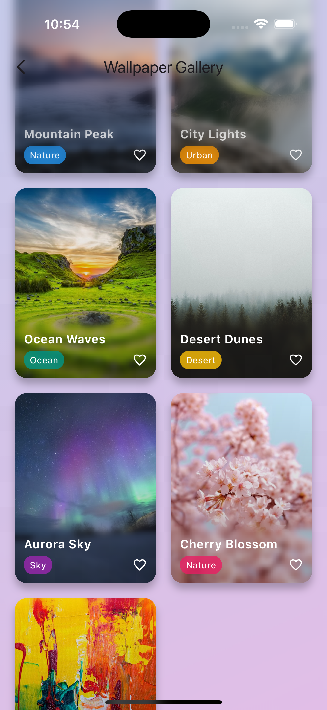
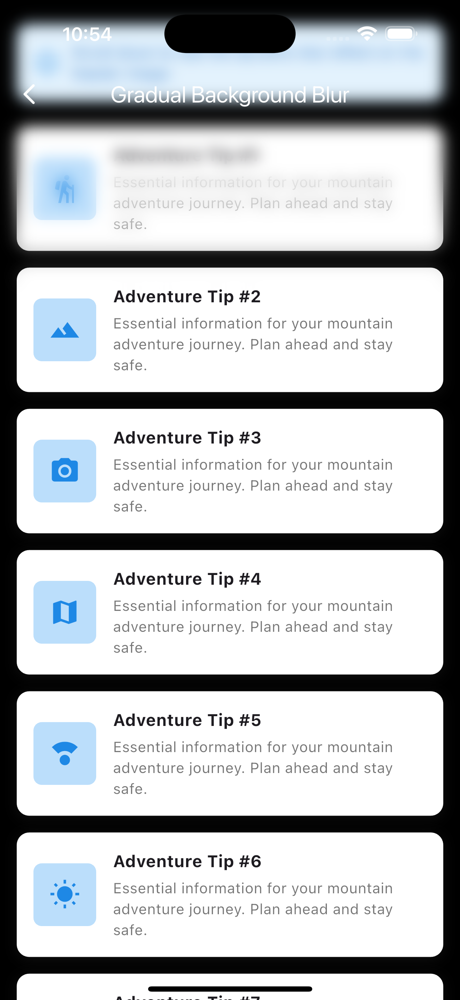
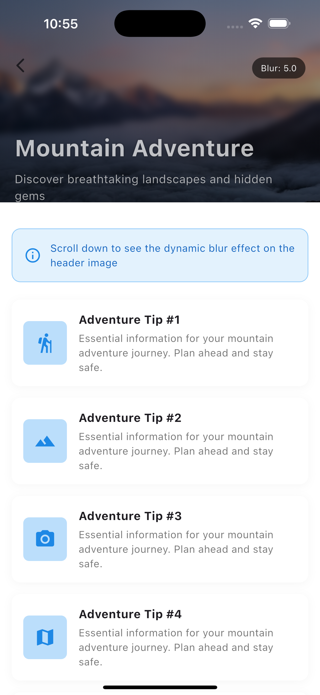
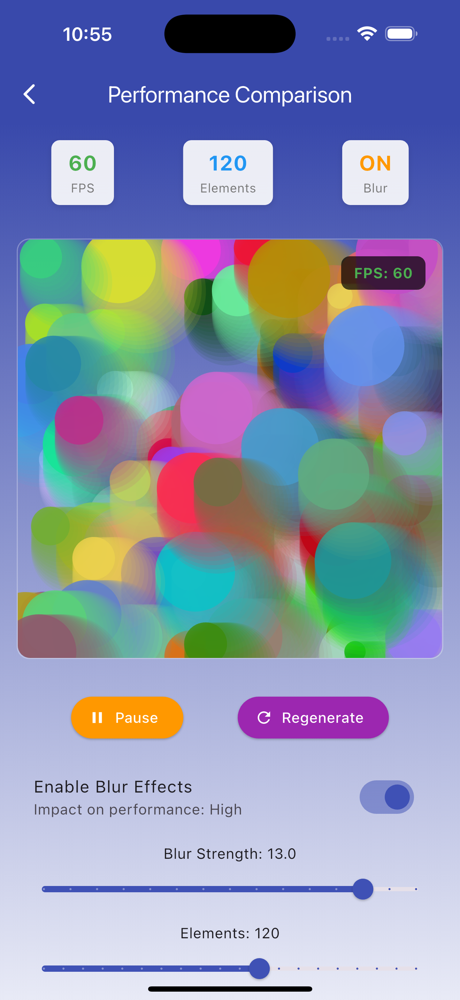

# Variable Blur

A Flutter package that provides customizable blur effects including tilt-shift blur for creating depth-of-field and variable blur effects in your Flutter applications.

## Screenshots

| Example 1 | Example 2 | Example 3 (blur with scroll) |
|-------------------|-----------------|---------------|
|  |  |  |

| Example 4 (Blurred Header) | Performance comparison |
|-------------------|----------------|
|  |  |

## Features

- **Variable Blur Effects**: Apply blur effects with different intensities on different sides of a widget
- **Tilt-Shift Blur**: Create professional depth-of-field effects similar to tilt-shift photography
- **Customizable Blur Sides**: Control blur intensity independently on top, bottom, left, and right sides
- **Performance Optimized**: Uses GPU shaders for smooth, high-performance blur rendering
- **Color Tinting**: Add custom color tints to blur effects
- **Quality Control**: Adjustable quality settings for performance optimization

## Getting started

Add this package to your `pubspec.yaml`:

```yaml
dependencies:
  variable_blur: ^0.0.1
```

Then run:

```bash
flutter pub get
```

Import the package in your Dart code:

```dart
import 'package:variable_blur/variable_blur.dart';
```

## Usage

### Basic Variable Blur

Wrap any widget with `VariableBlur` to apply customizable blur effects:

```dart
VariableBlur(
  sigma: 5.0,
  blurSides: BlurSides.horizontal(left: 1.0, right: 1.0),
  child: Container(
    width: 200,
    height: 200,
    decoration: BoxDecoration(
      image: DecorationImage(
        image: AssetImage('assets/your_image.jpg'),
        fit: BoxFit.cover,
      ),
    ),
  ),
)
```

### Tilt-Shift Photography Effect

Create a tilt-shift blur effect for depth-of-field photography:

```dart
VariableBlur(
  sigma: 8.0,
  blurSides: BlurSides.vertical(top: 1.0, bottom: 1.0),
  quality: BlurQuality.high,
  child: Image.asset('assets/landscape.jpg'),
)
```

### Dynamic Scroll-Based Blur

Create dynamic blur effects that respond to user interactions:

```dart
class ScrollBlurExample extends StatefulWidget {
  @override
  _ScrollBlurExampleState createState() => _ScrollBlurExampleState();
}

class _ScrollBlurExampleState extends State<ScrollBlurExample> {
  double blurSigma = 0.0;
  final ScrollController _scrollController = ScrollController();

  @override
  void initState() {
    super.initState();
    _scrollController.addListener(_onScroll);
  }

  void _onScroll() {
    const maxBlur = 8.0;
    const scrollThreshold = 200.0;

    setState(() {
      blurSigma = maxBlur * (_scrollController.offset / scrollThreshold).clamp(0.0, 1.0);
    });
  }

  @override
  Widget build(BuildContext context) {
    return CustomScrollView(
      controller: _scrollController,
      slivers: [
        SliverAppBar(
          expandedHeight: 300,
          flexibleSpace: VariableBlur(
            sigma: blurSigma,
            blurSides: BlurSides.vertical(bottom: 1.0),
            child: FlexibleSpaceBar(
              background: Image.asset('assets/header_image.jpg', fit: BoxFit.cover),
            ),
          ),
        ),
        // Your scrollable content here
      ],
    );
  }
}
```

### Blur Sides Configuration

Control blur intensity on different sides:

```dart
// Horizontal blur only
BlurSides.horizontal(left: 0.5, right: 0.8)

// Vertical blur only
BlurSides.vertical(top: 1.0, bottom: 0.3)
```

## API Reference

### VariableBlur

The main widget for applying variable blur effects.

| Parameter      | Type          | Default            | Description                                            |
| -------------- | ------------- | ------------------ | ------------------------------------------------------ |
| `child`        | `Widget`      | required           | The widget to apply blur effects to                    |
| `sigma`        | `double`      | required           | The blur intensity (0.0 = no blur, higher = more blur) |
| `blurSides`    | `BlurSides`   | required           | Configuration for which sides to blur                  |
| `quality`      | `BlurQuality` | `BlurQuality.high` | Quality setting for performance optimization           |
| `edgeIntensity`| `double`      | `0.15`             | Controls smoothness of blur transitions (0.0 to 1.0)  |
| `isYFlipNeed`  | `bool`        | `false`            | Whether to flip Y-axis for Android compatibility       |

### BlurSides

Configuration class for controlling blur on different sides.

#### Constructors

- `BlurSides.horizontal({double left, double right})` - Apply blur horizontally
- `BlurSides.vertical({double top, double bottom})` - Apply blur vertically

### BlurQuality

Enum for controlling blur quality vs performance:

- `BlurQuality.low` - Faster rendering, lower quality
- `BlurQuality.medium` - Balanced quality and performance
- `BlurQuality.high` - Best quality, slower rendering

## Kernel Size and Performance

- Kernel size is now automatically calculated based on your `sigma` value and `quality` setting.
- **Higher sigma values automatically use larger kernel sizes** for smooth, natural blur effects.
- **Quality settings control the kernel size multiplier:**
  - **Low Quality**: Smaller kernels for better performance (good for animations)
  - **Medium Quality**: Balanced kernels for most use cases
  - **High Quality**: Full-size kernels for best visual quality
- The system automatically caps kernel sizes at safe limits to prevent performance issues.
- You no longer need to manually adjust kernel size - just focus on `sigma` and `quality`!

## Recommended Sigma Values

- For most use cases, a `sigma` value of **12** provides a good blur effect that is visually pleasing and performant.
- The recommended range for `sigma` is **12** to **15**.
- Higher sigma values will increase blur strength but also require a larger kernel size and more computational power.
- Always test different sigma values to find the best balance for your app and device performance.

## Performance Tips

1. **Use appropriate quality settings**: Lower quality settings for animations, higher for static effects
2. **Limit blur sigma values**: Very high sigma values (>15) can impact performance
3. **Choose optimal quality**: The quality setting automatically adjusts kernel size for best performance
4. **Consider widget tree placement**: Apply blur as close to the target widget as possible
5. **Cache blur effects**: For static content, consider using RepaintBoundary

## Examples

The package includes several examples in the `/example` folder:

- Basic variable blur effects
- Tilt-shift photography simulation
- Scroll-responsive blur backgrounds
- Performance optimization techniques

### Visual Examples

| Effect Type | Description |
|------------|-------------|
| **Tilt-Shift Blur** | Professional depth-of-field effects similar to tilt-shift photography |
| **Horizontal Blur** | Apply blur effects horizontally for creative transitions |
| **Vertical Blur** | Vertical blur effects perfect for scroll-based animations |
| **Dynamic Effects** | Real-time blur adjustments based on user interactions |

Run the example app:

```bash
cd example
flutter run
```

## Troubleshooting

### Flickering with High Sigma Values

If you experience flickering when using high sigma values (like `sigma: 20`), this is typically due to GPU resource allocation on the first frame. We've addressed this issue in the latest version by adding the `kernelSize` parameter.

**Solution:**
1. Update to the latest version (`^0.0.7`)
2. The kernel size is now automatically calculated based on sigma and quality:
```dart
VariableBlur(
  sigma: 20.0,           // High blur intensity
  quality: BlurQuality.medium, // Automatically adjusts kernel size
  blurSides: BlurSides.vertical(top: 0.5, bottom: 0.5),
  child: yourWidget,
)
```

**Quality Settings:**
- **High Quality**: Full kernel size for best quality (may be slower)
- **Medium Quality**: Balanced kernel size for good performance
- **Low Quality**: Reduced kernel size for best performance
